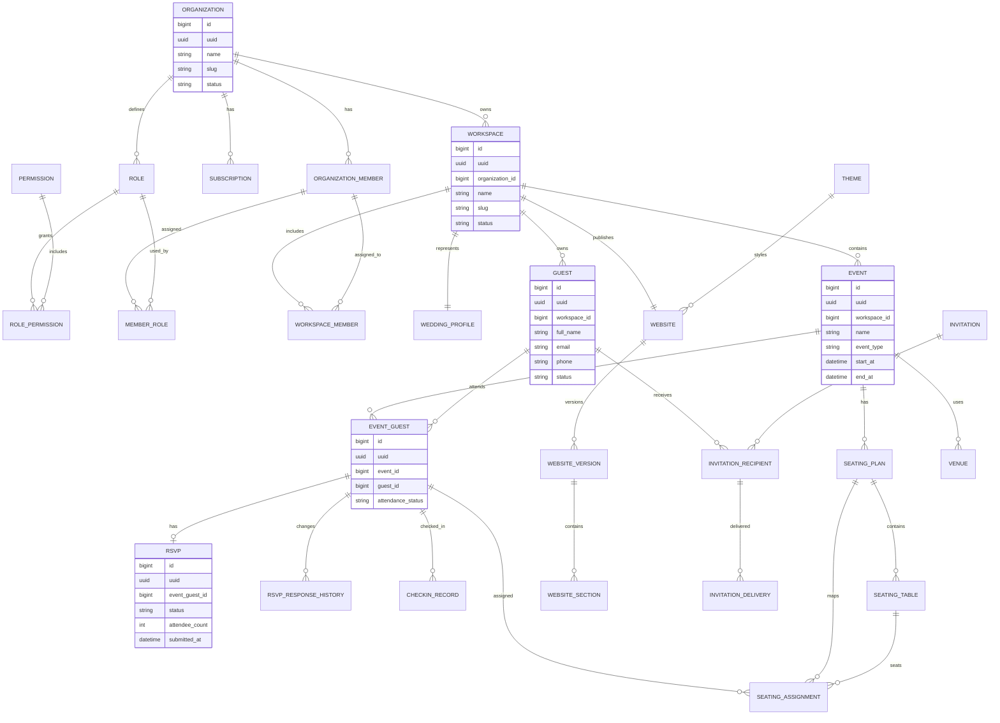

# Premium Wedding SaaS — Domain Model + Core Entity/Data Model + Multi-Tenant/RBAC Model

**Document ID:** PWS-ARCH-001  
**Version:** 0.1  
**Status:** Architecture Foundation — Draft  
**Date:** 2026-08-24  
**Product:** Premium Wedding SaaS  
**Primary Sources:** `Premium_Wedding_SaaS_PRD_v0.1.md`, `Premium_Wedding_SaaS_Release_Roadmap_and_Zero_Cost_Strategy_v0.1.md`

---

## 1. Tujuan Dokumen

Dokumen ini menetapkan fondasi konseptual untuk tiga area yang harus stabil sebelum implementasi database dan backend dimulai:

1. **Domain Model** — bagaimana konsep bisnis Premium Wedding SaaS saling berhubungan.
2. **Core Entity / Data Model** — entity utama, ownership, lifecycle, relationship, dan prinsip persistence.
3. **Multi-Tenant / RBAC Model** — isolasi organisasi, workspace scope, role, permission, membership, dan enforcement model.

Dokumen ini **bukan schema SQL final**. Ia menjadi kontrak arsitektural sebelum physical schema, API contract, RLS policy, workflow engine, dan implementation detail dibuat.

---

## 2. Basis Pengetahuan dan Batasan

### 2.1 Fakta yang sudah ditetapkan oleh PRD

PRD secara eksplisit menetapkan bahwa produk:

- adalah **multi-tenant SaaS**;
- menjadikan **Organization, Workspace, User, Role, Permission, Billing, dan Data Isolation** sebagai first-class concepts;
- satu Organization dapat mengelola banyak wedding/client workspace;
- satu wedding dapat memiliki beberapa event;
- guest, invitation, RSVP, seating, check-in, messaging, gift, analytics, media, activity, dan billing merupakan bagian dari product scope;
- server-side permission enforcement merupakan security boundary;
- tenant isolation dan workspace isolation merupakan business rules;
- pertumbuhan diantisipasi dari 1 hingga 1.000+ organizations tanpa domain rewrite.

### 2.2 Keputusan arsitektural yang ditambahkan dalam dokumen ini

Bagian berikut merupakan **arsitektur yang direkomendasikan berdasarkan PRD**, bukan requirement eksplisit yang sudah final:

- pemisahan `Platform → Organization → Workspace → Domain Entity`;
- `Membership` sebagai penghubung user terhadap organization;
- role assignment bersifat organization-scoped secara default;
- permission terdiri dari `resource + action`;
- workspace-specific access menggunakan assignment/scope tambahan bila dibutuhkan;
- semua business tables menggunakan pasangan `id` dan `uuid` untuk kebutuhan audit/internal reference dan external-safe identifier;
- tenant ownership lebih baik eksplisit pada aggregate root daripada mengandalkan inferensi join yang terlalu panjang;
- public guest access dipisahkan dari authenticated staff RBAC.

Keputusan di atas harus divalidasi sebelum physical database schema dikunci.

---

# 3. Domain Model

## 3.1 Business Hierarchy

Model domain utama:

```text
Platform
│
├── Platform Administration
│   ├── Platform User
│   ├── Feature Flag
│   ├── SaaS Plan
│   ├── Subscription
│   ├── Billing / Invoice
│   └── Platform Audit
│
└── Organization  ← Tenant Boundary
    │
    ├── Organization Profile
    ├── Organization Members
    ├── Roles / Permissions
    ├── Subscription / Billing
    ├── Organization Settings / Branding
    ├── CRM
    │
    └── Wedding Workspace
        │
        ├── Couple / Client
        ├── Wedding Profile
        ├── Website / Invitation Site
        ├── Website Versions
        ├── Theme / Customization
        ├── Events
        │   ├── Venue
        │   ├── Schedule
        │   ├── Event Guest Scope
        │   ├── RSVP
        │   ├── Seating
        │   └── Check-in
        ├── Guests
        ├── Guest Groups / Tags / Relationships
        ├── Invitations / Campaigns
        ├── Messages
        ├── Gifts / Registry
        ├── Media
        ├── Tasks / Workflow
        ├── Analytics
        └── Activity / Audit
```

### 3.2 Domain Boundary

| Domain | Aggregate / Primary Concern | Ownership |
|---|---|---|
| Platform | SaaS operation, plans, feature flags, platform administration | Platform |
| Organization | Business tenant, members, branding, billing relationship | Organization |
| CRM | Leads, clients, proposals, pipeline, client history | Organization |
| Wedding | Wedding/client project identity and lifecycle | Workspace |
| Event | Individual ceremony/reception/engagement/etc. | Workspace |
| Guest | Person/contact participating in wedding lifecycle | Workspace |
| Invitation | Distribution and personalized invitation state | Workspace / Guest |
| RSVP | Guest response state per event | Workspace / Event |
| Seating | Table and seating allocation | Workspace / Event |
| Check-in | On-site attendance state | Workspace / Event |
| Communication | Message templates, campaigns, delivery state | Workspace / Organization |
| Media | Wedding and guest media | Workspace |
| Gift / Registry | Gift configuration and transaction/reference records | Workspace |
| Automation | Trigger-condition-action workflows | Organization / Workspace |
| Analytics | Derived metrics and reporting | Organization / Workspace |
| Activity / Audit | Traceability of security/business-critical changes | Scope-owning aggregate |
| Billing | SaaS subscription, invoice, payment state | Organization / Platform |

---

# 4. Core Domain Concepts

## 4.1 Platform

Platform adalah level SaaS global. Platform tidak termasuk dalam tenant organization.

Responsibilities:

- mengelola organizations;
- mengelola SaaS plans;
- subscription oversight;
- feature flags;
- platform configuration;
- support administration;
- platform-level audit;
- platform billing oversight.

Platform-level access harus sangat terbatas dan tidak boleh dipakai sebagai pola normal untuk operational staff.

---

## 4.2 Organization

`Organization` adalah **tenant boundary utama**.

Contoh:

```text
PT Wedding Nusantara
CV Elegant Event
Studio A Wedding
```

Satu organization dapat memiliki:

- banyak users/members;
- banyak workspace wedding/client;
- banyak staff assignment;
- satu subscription aktif pada suatu waktu atau histori subscription;
- branding/settings sendiri;
- CRM sendiri;
- analytics agregat sendiri.

### Invariant

> User yang tidak memiliki membership/authorization terhadap Organization A tidak boleh membaca atau memodifikasi data private Organization A.

---

## 4.3 Workspace

`Workspace` mewakili **satu proyek wedding/client** yang dikelola organization.

Nama "Wedding Workspace" dipakai karena PRD menjadikan workspace sebagai wadah data wedding.

Contoh:

```text
Organization: Elegant Event
├── Workspace: Wedding Budi & Sinta
├── Workspace: Wedding Andi & Maya
└── Workspace: Corporate Gala 2027
```

Walaupun MVP berfokus pada wedding, model workspace sengaja dibuat cukup generik agar tidak mengunci platform pada satu jenis event selamanya.

### Workspace owns / references

- wedding profile;
- couple/client;
- website;
- events;
- guests;
- invitations;
- RSVP;
- seating;
- check-in;
- media;
- operational tasks;
- workspace analytics;
- workspace activity.

---

## 4.4 Couple / Client

`Couple` merepresentasikan pihak utama wedding pada domain wedding.

PRD menyebut couple profile, parents/family information, wedding data, dan limited couple access.

Satu workspace pada MVP dapat diasumsikan memiliki satu primary couple/client profile, tetapi model harus memungkinkan future support untuk struktur client yang lebih kompleks.

Recommended abstraction:

```text
Workspace
  └── Client / Couple Profile
       ├── Person A
       ├── Person B
       └── Family / Parent Relations
```

---

## 4.5 Event

`Event` adalah kejadian spesifik di dalam satu workspace.

Contoh:

- Akad
- Pemberkatan
- Resepsi
- Engagement
- After Party

Satu workspace dapat memiliki banyak event.

Setiap event dapat memiliki:

- date/time;
- timezone;
- venue;
- capacity;
- visibility;
- event-specific guest assignment;
- event-specific RSVP;
- event-specific QR;
- event-specific check-in rules;
- event schedule.

---

## 4.6 Venue

`Venue` menyimpan lokasi fisik event:

- name;
- address;
- latitude/longitude;
- maps link;
- optional capacity metadata;
- operational notes.

Venue dapat direuse antar event di masa depan, sehingga hubungan yang dianjurkan adalah:

```text
Organization
  └── Venue Directory (optional shared master)
          ↓
        Event
```

Namun untuk MVP, venue dapat tetap sederhana sebagai entity workspace/event.

---

## 4.7 Guest

`Guest` adalah entity people-centric yang menjadi pusat sebagian besar guest lifecycle.

Guest dapat mempunyai:

- identity/contact data;
- group;
- tags;
- relationship;
- family association;
- VIP state;
- plus-one allowance;
- notes;
- lifecycle state;
- history.

### Penting

Guest **bukan** entity yang didefinisikan ulang untuk setiap event.

Guest identity sebaiknya menjadi entity reusable dalam workspace, sementara keikutsertaan guest pada event disimpan pada association entity.

Model:

```text
Guest
  └── Event Guest Assignment
         └── Event
```

Ini menghindari duplikasi data saat seorang guest menghadiri dua event pada wedding yang sama.

---

## 4.8 Invitation

Invitation adalah representation dari proses distribusi undangan kepada guest.

Konsep utama:

```text
Guest
  └── Invitation Recipient
        └── Invitation / Campaign
              └── Delivery Attempt(s)
```

Invitation harus mendukung:

- unique invitation token;
- personalized URL;
- personalized greeting;
- QR;
- delivery status;
- open/click state;
- failure state;
- expiration;
- reminder.

### Security invariant

Invitation token harus tidak mudah ditebak dan tidak menjadikan raw database ID sebagai public identifier utama.

---

## 4.9 RSVP

RSVP adalah current response state seorang guest terhadap event.

Model yang disarankan:

```text
Guest
  └── Event Guest Assignment
        └── RSVP Current State
              └── RSVP History
```

Current state dan history sengaja dipisahkan agar:

- query dashboard tetap cepat;
- perubahan response tetap dapat diaudit;
- contradictory response dapat dicegah.

---

## 4.10 Seating

Seating domain terdiri dari:

```text
Event
├── Seating Plan
├── Table
│   └── Table Seat / Capacity
└── Guest Seat Assignment
```

Business rule penting:

- satu guest tidak boleh mempunyai dua assignment aktif pada event yang sama;
- capacity table tidak boleh dilampaui kecuali override eksplisit;
- reserved/VIP table harus dibedakan dari general table;
- conflict detection harus menjadi domain service, bukan sekadar UI validation.

---

## 4.11 Check-in

Check-in adalah operational event yang merepresentasikan kehadiran guest di venue.

Model:

```text
Guest
  └── Event Guest Assignment
        └── Check-in Record
```

Check-in harus idempotent.

Contoh invariant:

```text
same guest + same event + same attendance session
→ cannot create duplicate valid check-in
```

History tetap dapat disimpan bila terdapat correction/manual override.

---

## 4.12 Communication

Communication domain harus dipisahkan dari Invitation domain karena messaging akan dipakai untuk:

- invitation delivery;
- RSVP reminders;
- event reminders;
- follow-up;
- CRM communication;
- operational notifications.

Model:

```text
Template
   ↓
Campaign
   ↓
Recipient
   ↓
Message
   ↓
Delivery Attempt(s)
```

Provider seperti WhatsApp/email/SMS adalah infrastructure concern, bukan domain identity.

---

## 4.13 Gift / Registry

Domain gift/registry harus memisahkan:

- gift settings;
- registry item/account;
- guest-facing payment intent;
- verified payment transaction;
- reconciliation/reference.

Status pembayaran tidak boleh ditentukan hanya dari browser redirect. Source of truth harus berasal dari verified provider event/webhook.

---

## 4.14 Media

Media domain mencakup:

- wedding images;
- gallery;
- guest uploads;
- media blocks;
- thumbnails/derivatives;
- moderation metadata.

File binary tidak seharusnya menjadi data utama pada core relational tables. Database menyimpan metadata/reference; object storage menyimpan binary.

---

## 4.15 Website / Invitation Site

Website harus dianggap sebagai domain state, bukan sekadar JSON blob.

Model konseptual:

```text
Workspace
  └── Website
       ├── Theme
       ├── Page / Site Structure
       ├── Section
       ├── Asset Reference
       ├── Draft Version
       └── Published Version
```

### Publish model

Draft dan Published State harus dipisahkan.

```text
EDIT
  ↓
DRAFT
  ↓ publish
PUBLISHED SNAPSHOT
```

Pengunjung publik tidak seharusnya membaca state editor yang sedang berubah kecuali feature tersebut memang dirancang live-preview.

---

## 4.16 Automation

Automation mengikuti pola yang sudah didefinisikan roadmap:

```text
Trigger
   ↓
Condition(s)
   ↓
Action(s)
```

Contoh trigger:

- RSVP submitted;
- RSVP pending;
- invitation opened;
- deadline approaching;
- guest checked in.

Automation adalah cross-domain capability sehingga implementation sebaiknya tidak membuat foreign-key coupling berlebihan antar modul.

---

# 5. Core Entity / Data Model

## 5.1 Entity Classification

### A. Platform / SaaS

- `platform_user`
- `organization`
- `organization_member`
- `role`
- `permission`
- `role_permission`
- `member_role`
- `saas_plan`
- `subscription`
- `invoice`
- `payment_transaction`
- `feature`
- `plan_feature`
- `organization_feature_override`
- `platform_audit_log`

### B. Organization

- `organization_profile`
- `organization_branding`
- `organization_setting`
- `team_assignment`
- `client`
- `lead`
- `crm_activity`
- `organization_activity`

### C. Wedding Workspace

- `workspace`
- `workspace_member`
- `wedding_profile`
- `couple_person`
- `family_relation`
- `workspace_setting`
- `workspace_activity`

### D. Event

- `event`
- `venue`
- `event_schedule_item`
- `event_guest`
- `event_setting`

### E. Guest

- `guest`
- `guest_group`
- `guest_group_member`
- `guest_tag`
- `guest_tag_assignment`
- `guest_relationship`
- `guest_note`
- `guest_history`

### F. Invitation

- `invitation`
- `invitation_recipient`
- `invitation_token`
- `invitation_campaign`
- `invitation_delivery`
- `invitation_event`

### G. RSVP

- `rsvp`
- `rsvp_response_history`
- `rsvp_answer`

### H. Seating

- `seating_plan`
- `seating_table`
- `seating_assignment`

### I. Check-in

- `checkin_session`
- `checkin_record`
- `checkin_correction`

### J. Communication

- `message_template`
- `message_campaign`
- `message_recipient`
- `message`
- `message_delivery_attempt`

### K. Website / Content

- `website`
- `website_version`
- `website_section`
- `website_section_config`
- `theme`
- `theme_preset`
- `website_publish`
- `seo_metadata`
- `social_preview_metadata`

### L. Media

- `media_asset`
- `media_variant`
- `media_usage`
- `media_moderation`

### M. Gift / Financial Wedding Domain

- `gift_configuration`
- `gift_recipient_account`
- `gift_payment_intent`
- `gift_transaction`
- `gift_reconciliation`

### N. Workflow / Automation

- `automation`
- `automation_trigger`
- `automation_condition`
- `automation_action`
- `automation_execution`

### O. Audit

- `audit_log`
- `security_event`
- `webhook_event`
- `integration_event`

---

# 6. Canonical Relationship Model

```text
PLATFORM
   │
   ├── SaaS Plan
   ├── Feature
   └── Platform User
           │
           ▼
ORGANIZATION (TENANT)
   │
   ├── Subscription
   ├── Organization Members
   │      └── Roles ── Permissions
   │
   ├── CRM
   │
   └── WORKSPACE (WEDDING)
          │
          ├── Wedding Profile
          ├── Couple / Client
          ├── Website
          │     ├── Versions
          │     ├── Sections
          │     └── Media
          │
          ├── EVENT
          │     ├── Venue
          │     ├── Schedule
          │     ├── Event Guests
          │     │      └── Guest
          │     │             ├── Invitation
          │     │             ├── RSVP
          │     │             ├── Seating
          │     │             └── Check-in
          │     └── Seating Plan
          │
          ├── Communication
          ├── Gift / Wedding Payment
          ├── Automation
          ├── Analytics
          └── Activity / Audit
```

---

# 7. Aggregate Ownership Rules

## 7.1 Organization-owned aggregates

Contoh:

- organization profile;
- members;
- billing/subscription;
- CRM;
- organization branding;
- organization-level automation;
- organization analytics.

## 7.2 Workspace-owned aggregates

Contoh:

- wedding profile;
- website;
- guest;
- invitation;
- event;
- seating;
- check-in;
- media;
- workspace-level automation.

## 7.3 Event-owned state

Contoh:

- event guest assignment;
- RSVP for event;
- seating assignment;
- check-in record;
- event-specific QR.

### Rule

Entity tidak boleh "melompat" ownership tanpa explicit relationship.

Contoh yang harus dihindari:

```text
Guest → Event → Organization B
```

jika Guest tersebut dimiliki oleh Organization A.

---

# 8. Recommended Physical Data Conventions

## 8.1 Primary Key Convention

Untuk business tables yang dibuat oleh aplikasi:

```text
id      BIGINT GENERATED ALWAYS AS IDENTITY  ← internal/audit friendly
uuid    UUID NOT NULL UNIQUE                  ← external-safe reference
```

Alasan:

- `id` nyaman untuk audit/internal ordering;
- `uuid` aman digunakan pada external API/public references;
- perubahan identifier internal tidak harus mengubah public contract.

Catatan: entity yang berasal langsung dari provider authentication seperti `auth.users`/provider-managed identities mengikuti identifier provider dan tidak dipaksa mengikuti pola di atas bila tidak relevan.

## 8.2 Common Audit Columns

Business tables sebaiknya mengikuti pola minimal:

```text
created_at
updated_at
created_by
updated_by
```

Untuk entity yang membutuhkan lifecycle:

```text
status
archived_at
archived_by
```

Soft delete hanya dipakai ketika business history memang penting. Jangan menggunakan soft delete secara otomatis untuk setiap table.

## 8.3 Optimistic Concurrency

Entity yang rawan edit bersamaan menggunakan:

```text
version
```

atau optimistic `updated_at` comparison.

Minimal untuk:

- website draft;
- seating plan;
- guest bulk edits;
- workspace settings;
- workflow definitions;
- operational admin records.

---

# 9. Core Table Contract

## 9.1 `organization`

```text
id
uuid
name
slug
status
created_at
updated_at
```

Business role: Tenant root.

Constraints:

- `slug` unique;
- organization status tidak boleh menentukan hilangnya historical data secara otomatis.

---

## 9.2 `organization_member`

```text
id
uuid
organization_id
user_id
status
joined_at
invited_at
removed_at
created_at
updated_at
```

Relationship:

```text
organization 1 ─── N organization_member N ─── 1 user
```

Member adalah security boundary untuk organization-level access.

---

## 9.3 `role`

```text
id
uuid
organization_id nullable
code
name
description
is_system
created_at
updated_at
```

Interpretasi:

- `organization_id = NULL` → system role;
- `organization_id != NULL` → custom organization role.

Contoh system roles:

- Organization Owner
- Admin
- Event Manager
- Guest Manager
- Check-in Staff
- Client

Custom role memungkinkan organization membuat role internal tanpa mengubah permission engine.

---

## 9.4 `permission`

Canonical format:

```text
resource.action
```

Contoh:

```text
workspace.read
workspace.update
guest.read
guest.create
guest.update
guest.delete
invitation.send
rsvp.read
checkin.create
checkin.read
seating.update
billing.read
billing.manage
organization.members.manage
roles.manage
```

Permission tidak boleh didefinisikan berdasarkan screen UI.

**Benar:** `guest.update`  
**Salah:** `guest_page.edit_button`

---

## 9.5 `role_permission`

```text
id
uuid
role_id
permission_id
created_at
```

Unique constraint:

```text
(role_id, permission_id)
```

---

## 9.6 `member_role`

```text
id
uuid
organization_member_id
role_id
workspace_id nullable
created_at
```

Ini memungkinkan:

```text
User A
├── Organization role: Admin
└── Workspace role: Event Manager
       └── Wedding Budi & Sinta
```

### Rekomendasi

MVP dapat memulai dengan satu role utama per member untuk mengurangi kompleksitas. Schema tetap disiapkan agar multiple roles dan workspace-specific role assignment dapat diperluas tanpa redesign.

---

## 9.7 `workspace`

```text
id
uuid
organization_id
name
slug
status
archived_at
created_at
updated_at
```

Invariant:

```text
workspace.organization_id MUST remain immutable
```

Perubahan ownership tenant tidak boleh menjadi update biasa; harus berupa controlled migration/admin operation dengan audit penuh.

---

## 9.8 `workspace_member`

```text
id
uuid
workspace_id
organization_member_id
status
assigned_at
removed_at
created_at
updated_at
```

Digunakan untuk assignment eksplisit ketika user hanya boleh mengakses workspace tertentu.

---

## 9.9 `wedding_profile`

```text
id
uuid
workspace_id
wedding_title
slug
wedding_status
wedding_date
timezone
logo_media_id
cover_media_id
created_at
updated_at
version
```

Unique:

```text
workspace_id
```

karena pada model MVP satu workspace merepresentasikan satu wedding/client project.

---

## 9.10 `event`

```text
id
uuid
workspace_id
name
event_type
start_at
end_at
timezone
visibility
capacity
status
venue_id nullable
created_at
updated_at
```

Relationship:

```text
workspace 1 ─── N event
```

---

## 9.11 `guest`

```text
id
uuid
workspace_id
full_name
email nullable
phone nullable
status
notes nullable
created_at
updated_at
```

Unique business identifier tidak boleh dipaksa hanya berdasarkan name. Duplicate detection membutuhkan domain logic.

Potential dedup key:

```text
normalized_name + normalized_phone
```

sebagai heuristic, bukan absolute identity.

---

## 9.12 `event_guest`

```text
id
uuid
event_id
guest_id
attendance_status
plus_one_allowed
plus_one_count
meal_preference nullable
special_requirement nullable
transport_preference nullable
accommodation_preference nullable
created_at
updated_at
```

Unique:

```text
(event_id, guest_id)
```

Entity ini menjadi pivot utama antara guest identity dan event participation.

---

## 9.13 `invitation`

```text
id
uuid
workspace_id
type
status
published_at
expires_at nullable
created_at
updated_at
```

`invitation_token` tidak disimpan sebagai raw public identifier tanpa protection.

Disarankan:

```text
invitation_token_hash
```

dan token plaintext hanya hadir saat issuance/verification flow bila arsitektur memang memerlukannya.

---

## 9.14 `invitation_recipient`

```text
id
uuid
invitation_id
event_id nullable
guest_id
personalized_name
personalized_url_slug
status
created_at
updated_at
```

Unique candidate:

```text
(invitation_id, guest_id)
```

---

## 9.15 `rsvp`

```text
id
uuid
event_guest_id
status
attendee_count
plus_one_count
submitted_at
updated_at
version
```

Current state.

### `rsvp_response_history`

Append-only history untuk:

- old status;
- new status;
- timestamp;
- source;
- actor/public token context.

---

## 9.16 `seating_plan`

```text
id
uuid
event_id
name
status
version
created_at
updated_at
```

### `seating_table`

```text
id
uuid
seating_plan_id
name
capacity
table_type
status
created_at
updated_at
```

### `seating_assignment`

```text
id
uuid
seating_plan_id
event_guest_id
table_id
seat_number nullable
created_at
updated_at
```

Unique:

```text
(seating_plan_id, event_guest_id)
```

---

## 9.17 `checkin_record`

```text
id
uuid
event_guest_id
checkin_session_id
checked_in_at
channel
operator_member_id nullable
status
created_at
updated_at
```

Critical invariant:

```text
one valid check-in per event_guest per active attendance session
```

Idempotency key sangat dianjurkan untuk scanner actions.

---

# 10. Website Data Model

## 10.1 Website

```text
website
├── website_version
│    ├── website_section
│    │    └── website_section_config
│    └── publish record
└── theme / theme preset
```

### Why versioning is core

PRD menyebut preview, publish, dan versioning. Oleh karena itu website editor sebaiknya tidak mengubah published data secara langsung.

```text
Current Draft
      │
      ├── autosave
      └── publish
             ↓
      Published Version
```

---

# 11. Billing / Subscription Data Model

SaaS billing dan wedding payment harus dipisahkan.

```text
Organization
   └── Subscription
          └── SaaS Plan
               └── Plan Features

Organization
   └── Invoice
         └── Billing Payment Transaction
```

Wedding gift/payment:

```text
Workspace
   └── Gift Configuration
          └── Gift Payment Intent
                  └── Verified Gift Transaction
```

Jangan membuat satu `payments` table generik yang ambigu untuk dua domain berbeda tanpa typed domain semantics.

---

# 12. Multi-Tenant Model

## 12.1 Tenant Boundary

```text
Platform
   │
   ├── Organization A
   │      ├── Workspace A1
   │      └── Workspace A2
   │
   ├── Organization B
   │      ├── Workspace B1
   │      └── Workspace B2
   │
   └── Organization C
          └── Workspace C1
```

### Mandatory invariant

Setiap private business row minimal dapat ditelusuri ke:

```text
organization_id
```

dengan cara langsung atau melalui ownership chain yang deterministic.

### Recommendation

Untuk table yang sering digunakan pada security-sensitive query, lebih baik menyimpan `organization_id` secara eksplisit walaupun dapat diinfer dari workspace/event.

Contoh:

```text
organization_id
workspace_id
```

Alasan:

- RLS lebih sederhana;
- index tenant-aware lebih mudah;
- query isolation lebih cepat;
- audit lebih mudah;
- mengurangi accidental cross-tenant joins.

Redundansi tersebut harus dijaga dengan FK/domain constraints atau trusted server-side write paths.

---

## 12.2 Tenant-aware Indexing

Index utama pada high-traffic tables biasanya diawali oleh tenant/workspace scope:

```text
(organization_id, created_at)
(organization_id, status)
(workspace_id, created_at)
(workspace_id, status)
(event_id, status)
```

Index spesifik mengikuti access pattern nyata, bukan dibuat massal.

---

## 12.3 Cross-Tenant Access

Cross-tenant access hanya untuk:

- platform super admin;
- support/admin capability yang secara eksplisit diizinkan;
- system-level jobs yang menggunakan trusted service role.

Normal organization member tidak boleh menerima global query tanpa tenant predicate.

---

# 13. RBAC Model

## 13.1 Layered Authorization

RBAC tidak boleh menjadi satu-satunya authorization dimension.

Model final:

```text
Authentication
      ↓
Organization Membership
      ↓
Role Assignment
      ↓
Permission
      ↓
Resource Scope
      ↓
Object / Record Constraints
```

Sehingga:

```text
Role ≠ Scope
Permission ≠ Ownership
```

Contoh:

> Event Manager memiliki `guest.update`, tetapi hanya pada workspace yang dia assigned.

---

## 13.2 System Roles

Role awal yang berasal dari PRD:

| Role | Scope utama | Default capability |
|---|---|---|
| Platform Super Admin | Platform | Full platform administration |
| Organization Owner | Organization | Full organization management |
| Organization Admin | Organization | Staff, settings, workspace operations |
| Event Manager / Project Manager | Workspace | Event operational management |
| Guest / Invitation Manager | Workspace | Guest, invitation, RSVP operations |
| Check-in Staff | Event | Check-in only + minimal guest lookup |
| Couple / Client | Workspace | Limited read/update on client-owned content |

Guest publik **bukan** organization role.

---

## 13.3 Permission Matrix — Foundation

### Organization

```text
organization.read
organization.update
organization.members.read
organization.members.manage
organization.settings.read
organization.settings.update
organization.billing.read
organization.billing.manage
organization.roles.read
organization.roles.manage
```

### Workspace

```text
workspace.read
workspace.create
workspace.update
workspace.archive
workspace.members.manage
```

### Wedding

```text
wedding.read
wedding.create
wedding.update
```

### Event

```text
event.read
event.create
event.update
event.delete
```

### Guest

```text
guest.read
guest.create
guest.update
guest.delete
guest.import
guest.export
guest.merge
```

### Invitation

```text
invitation.read
invitation.create
invitation.update
invitation.publish
invitation.send
invitation.cancel
```

### RSVP

```text
rsvp.read
rsvp.update
rsvp.export
```

### Seating

```text
seating.read
seating.update
seating.assign
seating.export
```

### Check-in

```text
checkin.read
checkin.create
checkin.correct
checkin.export
```

### Communication

```text
message.read
message.create
message.send
message.template.manage
message.campaign.manage
```

### Media

```text
media.read
media.upload
media.update
media.delete
media.moderate
```

### Gift / Financial

```text
gift.read
gift.manage
gift.transaction.read
gift.reconcile
```

### Automation

```text
automation.read
automation.create
automation.update
automation.enable
automation.disable
```

### Audit

```text
audit.read
security_event.read
```

---

# 14. RBAC + Workspace Scope

RBAC memberi kemampuan; scope menentukan di mana kemampuan itu berlaku.

## 14.1 Organization-level role

Contoh:

```text
Organization Admin
→ guest.read
→ guest.create
→ guest.update
```

Berlaku seluruh workspace organization tersebut.

## 14.2 Workspace-level assignment

Contoh:

```text
Event Manager
→ workspace W-001 only
```

Maka:

```text
Can:
  read/update W-001

Cannot:
  read/update W-002
```

## 14.3 Event-limited assignment

Check-in staff idealnya dapat dibatasi lagi:

```text
Check-in Staff
  → Event E-001
```

Bukan:

```text
Check-in Staff
  → entire workspace
```

---

# 15. Authorization Decision Model

Authorization untuk sebuah request mengikuti urutan:

```text
1. Is user authenticated?
          ↓ yes
2. Is user a member of the tenant?
          ↓ yes
3. Does assigned role contain required permission?
          ↓ yes
4. Does role scope include target workspace/event?
          ↓ yes
5. Does object belong to the authorized tenant/scope?
          ↓ yes
6. Allow
```

Jika salah satu gagal:

```text
DENY
```

Tidak ada fallback "karena UI menyembunyikan tombol".

---

# 16. Server-side Enforcement

PRD secara eksplisit menyatakan permission harus enforced server-side.

Recommended architecture:

```text
Client
  ↓
API / Server Action / RPC
  ↓
Authorization Context
  ↓
Tenant Scope
  ↓
Permission Check
  ↓
Domain Validation
  ↓
Database
```

Jika menggunakan PostgreSQL RLS, RLS menjadi **defense-in-depth dan tenant enforcement layer**, bukan pengganti domain authorization design.

Recommended principle:

```text
Application authorization
        +
Database RLS / equivalent isolation
        =
Defense in depth
```

---

# 17. Public Guest Access Model

Guest public access harus diperlakukan berbeda dari staff RBAC.

```text
Public Guest
   ↓
Invitation Token / Signed Access Context
   ↓
Guest-specific resource
```

Public token hanya boleh memberi akses minimum yang diperlukan untuk:

- membuka invitation;
- submit/update RSVP sesuai policy;
- melihat event information yang memang public;
- memperoleh guest QR bila diizinkan.

Public guest token tidak boleh menjadi jalan untuk:

- browse all guests;
- browse all RSVPs;
- browse organization data;
- access staff APIs;
- enumerate guest IDs.

---

# 18. Audit Model

Audit dibagi dua:

## 18.1 Activity Log

Digunakan untuk aktivitas operasional/user-facing:

```text
"Budi updated guest Sinta"
"Event Manager published invitation"
"Check-in Staff checked in guest"
```

## 18.2 Security / Audit Log

Digunakan untuk event sensitif:

```text
role changed
permission changed
member removed
billing status changed
invitation token revoked
payment webhook accepted
support access granted
cross-scope access attempted
```

### Recommended audit fields

```text
id
uuid
organization_id nullable
workspace_id nullable
actor_user_id nullable
actor_type
action
resource_type
resource_id
before_snapshot nullable
after_snapshot nullable
request_id
ip_address nullable
user_agent nullable
created_at
```

Sensitive payload harus diminimalkan sesuai kebutuhan audit/privacy.

---

# 19. State Management Principles

Entity yang bersifat current state:

- guest lifecycle state;
- RSVP current state;
- subscription state;
- check-in current state;
- invitation current delivery status;
- workspace status.

Entity yang membutuhkan history:

- RSVP changes;
- invitation delivery attempts;
- check-in corrections;
- billing webhook events;
- audit/security actions;
- important website publish versions.

Prinsip:

```text
Current State = optimized for current reads
History       = append-only evidence where business value requires it
```

---

# 20. Domain Invariants

Invariant berikut harus diperlakukan sebagai business rules, bukan sekadar frontend validation.

### Tenant

1. Resource private selalu memiliki tenant ownership yang jelas.
2. Cross-tenant access tidak diizinkan untuk normal organization users.

### Workspace

3. Workspace hanya dimiliki satu organization.
4. Workspace ownership tidak berubah melalui ordinary CRUD.

### Guest

5. Guest hanya ada satu kali sebagai identity dalam workspace kecuali ada explicit merge/split workflow.
6. Event participation menggunakan association, bukan duplikasi guest row.

### RSVP

7. Hanya satu current RSVP state aktif per `event_guest`.
8. History disimpan jika perubahan response harus dapat diaudit.

### Check-in

9. Check-in harus idempotent.
10. Duplicate scan tidak boleh menghasilkan dua valid attendance records.

### Invitation

11. Token harus non-guessable.
12. Token access tidak boleh memperluas tenant scope.

### Billing

13. Payment state berasal dari verified gateway events/webhooks.
14. Browser redirect bukan source of truth.

### RBAC

15. Permission enforced server-side.
16. Role assignment tidak boleh memberikan akses di luar tenant/scope.
17. Removing membership harus langsung menghilangkan effective access.

---

# 21. MVP Data Slice

Berdasarkan roadmap, physical implementation pertama tidak perlu membangun seluruh future domain.

## Must-have MVP entities

```text
organization
organization_member
role
permission
role_permission
member_role
workspace
wedding_profile
couple_person
event
venue
guest
event_guest
invitation
invitation_recipient
invitation_token
rsvp
rsvp_response_history
checkin_session
checkin_record
website
website_version
website_section
theme
media_asset
saas_plan
subscription
invoice
billing_payment_transaction
audit_log
```

## Intentionally deferred

- full CRM pipeline;
- advanced automation engine;
- marketplace;
- white-label;
- AI assistant;
- sophisticated seating intelligence;
- multi-provider payment routing;
- advanced vendor management.

Schema boleh disiapkan untuk future compatibility, tetapi jangan memaksakan implementation complexity ke MVP.

---

# 22. Recommended ERD — Conceptual



---

# 23. Architecture Decisions to Lock Before Coding

Berikut adalah keputusan yang sebaiknya dikunci sebelum physical schema implementation:

| Decision | Recommendation | Status |
|---|---|---|
| Tenant root | Organization | Recommended / strongly implied by PRD |
| Project boundary | Workspace | Recommended / directly aligned with PRD |
| User identity | Central auth identity + profile/member layer | Recommended |
| Membership | Explicit organization membership | Recommended |
| Role model | System + organization custom roles | Recommended |
| Permission model | Resource + action | Recommended |
| Scope model | Organization → Workspace → Event | Recommended |
| Tenant isolation | Explicit tenant ownership + server-side enforcement | Required |
| DB defense | RLS or equivalent | Recommended |
| Public guest access | Token-based isolated access context | Required by security rules |
| Website publishing | Draft vs published version | Recommended |
| RSVP | Current state + history | Required by integrity rule |
| Check-in | Idempotent operation | Required |
| Billing | Subscription/invoice/payment separated | Required |
| Audit | Activity + security audit | Required |
| External IDs | UUID | Recommended |
| Internal IDs | Auto-increment/identity `id` | Project convention |

---

# 24. Open Questions

Dokumen source belum mengunci beberapa hal berikut secara final:

1. Apakah satu workspace selalu tepat satu wedding, atau future generic events harus dapat hidup tanpa wedding identity?
2. Apakah Couple/Client menjadi authenticated member, external collaborator, atau hanya domain profile?
3. Apakah organization member dapat memiliki lebih dari satu active role pada waktu yang sama?
4. Apakah role dapat berbeda antar workspace untuk user yang sama?
5. Seberapa granular workspace/event-level assignment diperlukan pada MVP?
6. Apakah guest boleh exist lintas workspace dalam satu organization, atau harus distinct per workspace?
7. Bagaimana merger guest dilakukan tanpa merusak invitation/RSVP history?
8. Billing model final: per organization, per workspace, per guest volume, atau hybrid?
9. Apakah subscription entitlement perlu menjadi hard authorization signal untuk feature access?
10. Apakah website versioning perlu immutable snapshots atau hanya version records?
11. Apakah public RSVP token dapat digunakan untuk update response setelah submission, dan sampai kapan?
12. Apakah check-in harus mendukung offline-first pada V1/V2 atau cukup degraded-online mode terlebih dahulu?
13. Provider auth dan payment gateway final belum ditetapkan dalam PRD.

---

# 25. Implementation Guardrails

### Do

- enforce tenant scope server-side;
- gunakan explicit relationship untuk ownership;
- simpan current state dan history secara terpisah saat history memang bernilai;
- gunakan UUID untuk public-facing references;
- gunakan idempotency untuk action kritis;
- audit security-sensitive mutations;
- buat domain modules independen;
- desain dari MVP tetapi jangan merusak future extensibility.

### Jangan

- mengandalkan hidden UI sebagai authorization;
- query private data tanpa tenant predicate/scope;
- menggunakan guest name sebagai unique identity;
- menyimpan raw invitation token sebagai satu-satunya security control;
- menggabungkan SaaS billing dan wedding gift payment menjadi satu ambiguous domain;
- membuat satu `user_role` global yang mengabaikan tenant/workspace scope;
- memasukkan future marketplace/AI complexity ke MVP core transaction path.

---

# 26. Final Architectural Summary

Model yang direkomendasikan:

```text
AUTH IDENTITY
     │
     ▼
ORGANIZATION MEMBERSHIP
     │
     ▼
ROLE + PERMISSION
     │
     ▼
SCOPE
(Organization / Workspace / Event)
     │
     ▼
DOMAIN RESOURCE
     │
     ├── Wedding
     ├── Event
     ├── Guest
     ├── Invitation
     ├── RSVP
     ├── Seating
     ├── Check-in
     ├── Website
     ├── Communication
     ├── Gift
     └── Analytics
```

Dan tenant boundary:

```text
Platform
  ↓
Organization (TENANT)
  ↓
Workspace (WEDDING / CLIENT PROJECT)
  ↓
Event / Guest / Invitation / RSVP / Seating / Check-in / Website / Media
```

Prinsip paling penting:

> **Organization menentukan siapa pemilik data. Workspace menentukan proyek yang sedang dikelola. Role menentukan apa yang boleh dilakukan. Scope menentukan di mana role tersebut berlaku. Permission menentukan aksi yang diizinkan. Server/database memastikan semuanya benar-benar enforced.**

Dokumen ini menjadi baseline untuk tahap berikutnya: **Physical Database Schema → RLS / Authorization Matrix → API Contract → Domain Service Design → Workflow/Automation Design → Migration Plan**.

---

## Source Traceability

- `Premium_Wedding_SaaS_PRD_v0.1.md` — product model, user types, core domain hierarchy, business rules, MVP scope, security and tenant isolation.
- `Premium_Wedding_SaaS_Release_Roadmap_and_Zero_Cost_Strategy_v0.1.md` — release boundaries, MVP entities/capabilities, future expansion direction, automation pattern, and dependency philosophy.

