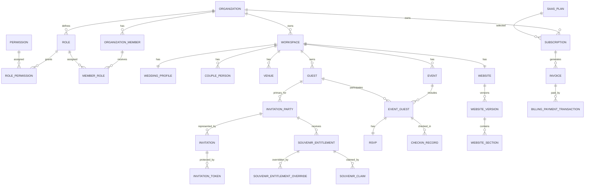

# Premium Wedding SaaS — Physical Database Schema Specification

**Document ID:** PWS-DB-001  
**Version:** 0.1  
**Status:** Baseline Physical Schema — Draft for Implementation Review  
**Date:** 2026-08-25

## 1. Purpose

Dokumen ini menerjemahkan Domain Model dan Architecture Decision Record (ADR) menjadi kontrak physical database untuk MVP.

Baseline ini digunakan untuk PostgreSQL/Supabase, migration, foreign key, constraint, index, tenant ownership, auditability, dan persiapan RLS.

Dokumen ini belum mendefinisikan detail RLS policy, API contract, atau domain-service implementation.

## 2. Decision Baseline

Schema ini mengikuti PRD, Release Roadmap, Domain/Core Data/RBAC Model, ADR v0.1, serta keputusan tambahan yang telah disepakati:

- Organization = tenant boundary.
- Workspace = satu proyek wedding/client untuk MVP.
- Supabase Auth = authentication provider.
- User profile terpisah dari `auth.users`.
- Staff membership terpisah dari couple/client access.
- User dapat memiliki multiple roles.
- Role dapat organization-, workspace-, atau event-scoped.
- Guest identity scoped per workspace.
- Guest tidak unique berdasarkan nama/email/phone.
- Invitation Party adalah unit undangan/QR.
- Satu QR mewakili satu Invitation Party.
- Actual attendance dipisahkan dari invited count.
- Souvenir entitlement default = invited person count.
- Entitlement dapat di-override dengan alasan dan authorization.
- Proxy souvenir claim diperbolehkan dengan staff confirmation.
- Claim harus atomic/idempotent dan tidak boleh melebihi entitlement.
- Published website version immutable.
- SaaS billing dan wedding payment adalah domain berbeda.
- Business tables menggunakan `id` + `uuid`.
- Soft delete bukan default global.

## 3. Common Conventions

### 3.1 Identifier

Business tables:

```sql
id   BIGINT GENERATED ALWAYS AS IDENTITY PRIMARY KEY
uuid UUID NOT NULL UNIQUE DEFAULT gen_random_uuid()
```

`id` untuk internal relation/audit; `uuid` untuk external-safe identifier.

Provider-managed identity seperti `auth.users` mengikuti identifier provider.

### 3.2 Timestamps

```sql
created_at TIMESTAMPTZ NOT NULL DEFAULT now()
updated_at TIMESTAMPTZ NOT NULL DEFAULT now()
```

### 3.3 Ownership

Private business rows harus mempunyai ownership path deterministic:

```text
Organization → Workspace → Domain Entity
```

Security-sensitive/high-traffic tables boleh menyimpan `organization_id` dan/atau `workspace_id` secara eksplisit.

Redundant ownership wajib dijaga oleh FK, composite FK, constraint, atau trusted write path.

### 3.4 Deletion

Tidak ada soft delete global. Setiap entity memakai RESTRICT, CASCADE, SET NULL, archival/soft-delete, atau append-only sesuai lifecycle.

---

# 4. Authentication & User

## 4.1 `user_profile`

```text
id
uuid
auth_user_id UUID NOT NULL UNIQUE
display_name
first_name
last_name
phone
avatar_url
locale
timezone
created_at
updated_at
```

`auth_user_id` → `auth.users.id`.

Password tidak disimpan di application database.

---

# 5. Tenant

## 5.1 `organization`

```text
id
uuid
name
slug
status
timezone
currency
locale
created_at
updated_at
```

Constraint: `UNIQUE(slug)`.

## 5.2 `organization_settings`

```text
id
uuid
organization_id UNIQUE
settings_json JSONB
created_at
updated_at
```

JSON hanya untuk configurable settings, bukan relational business state.

## 5.3 `organization_member`

```text
id
uuid
organization_id
user_profile_id
status
joined_at
left_at NULL
created_at
updated_at
```

Constraint:

```text
UNIQUE(organization_id, user_profile_id)
```

---

# 6. RBAC

## 6.1 `role`

```text
id
uuid
organization_id NULL
code
name
description
is_system
created_at
updated_at
```

System role: `organization_id IS NULL`.  
Custom role: `organization_id IS NOT NULL`.

## 6.2 `permission`

```text
id
uuid
resource
action
description
created_at
updated_at
```

Constraint:

```text
UNIQUE(resource, action)
```

## 6.3 `role_permission`

```text
id
uuid
role_id
permission_id
created_at
```

Constraint:

```text
UNIQUE(role_id, permission_id)
```

## 6.4 `member_role`

```text
id
uuid
organization_member_id
role_id
workspace_id NULL
event_id NULL
created_at
updated_at
```

Scope:

```text
workspace_id NULL, event_id NULL
→ organization scope

workspace_id NOT NULL, event_id NULL
→ workspace scope

workspace_id NOT NULL, event_id NOT NULL
→ event scope
```

`event_id` tidak boleh ada tanpa `workspace_id`.

## 6.5 `client_access`

Couple/client access dipisahkan dari staff membership.

```text
id
uuid
workspace_id
user_profile_id
access_role
status
created_at
updated_at
```

Constraint:

```text
UNIQUE(workspace_id, user_profile_id)
```

---

# 7. Workspace / Wedding

## 7.1 `workspace`

```text
id
uuid
organization_id
name
slug
status
timezone NULL
currency NULL
locale NULL
created_at
updated_at
```

Constraint:

```text
UNIQUE(organization_id, slug)
```

NULL timezone/currency/locale mewarisi organization default.

## 7.2 `wedding_profile`

```text
id
uuid
workspace_id UNIQUE
title
wedding_date
status
description
created_at
updated_at
```

## 7.3 `couple_person`

```text
id
uuid
workspace_id
role
display_name
first_name
last_name
phone NULL
email NULL
created_at
updated_at
```

---

# 8. Venue & Event

## 8.1 `venue`

```text
id
uuid
workspace_id
name
address NULL
city NULL
region NULL
postal_code NULL
country NULL
latitude NULL
longitude NULL
notes NULL
created_at
updated_at
```

Venue reusable dalam workspace.

## 8.2 `event`

```text
id
uuid
organization_id
workspace_id
venue_id NULL
name
event_type
starts_at
ends_at NULL
timezone
status -- DRAFT | SCHEDULED | LIVE | ENDED | CANCELLED
notes NULL
created_at
updated_at
```

Constraints:

- `workspace.organization_id = event.organization_id`.
- `venue` harus berasal dari workspace yang sama.
- `ends_at >= starts_at` bila ada.
- `status` harus memenuhi lifecycle state machine: `DRAFT → SCHEDULED → LIVE → ENDED` dgn `CANCELLED` dapat dari SCHEDULED/LIVE.

---

# 9. Guest

## 9.1 `guest`

```text
id
uuid
organization_id
workspace_id
display_name
first_name NULL
last_name NULL
email NULL
phone NULL
address NULL
notes NULL
status
created_at
updated_at
```

Tidak ada unique constraint global pada nama/email/phone.

Guest identity reusable hanya di dalam workspace.

## 9.2 `event_guest`

```text
id
uuid
organization_id
workspace_id
event_id
guest_id
attendance_status
created_at
updated_at
```

Constraint:

```text
UNIQUE(event_id, guest_id)
```

Event participation memakai association; guest tidak diduplikasi untuk setiap event.

---

# 10. Invitation Party

`Invitation Party` adalah unit undangan yang direpresentasikan oleh satu QR.

Contoh:

```text
Budi
Budi & Partner
Andi & Family
```

## 10.1 `invitation_party`

```text
id
uuid
organization_id
workspace_id
primary_guest_id
display_label
invited_person_count
actual_attendee_count
status
created_at
updated_at
```

Constraints:

```text
invited_person_count >= 1
actual_attendee_count >= 0
actual_attendee_count <= invited_person_count
```

Partner/plus-one tidak harus dibuat sebagai guest identity hanya karena label undangan menyebut partner.

---

# 11. Invitation

## 11.1 `invitation`

```text
id
uuid
organization_id
workspace_id
invitation_party_id
event_id NULL
title
status
sent_at NULL
expires_at NULL
created_at
updated_at
```

## 11.2 `invitation_token`

```text
id
uuid
organization_id
workspace_id
invitation_id
token_hash
expires_at NULL
revoked_at NULL
last_used_at NULL
created_at
updated_at
```

Constraint:

```text
UNIQUE(token_hash)
```

Token disimpan dalam bentuk hash, harus non-guessable, dan tidak boleh memperluas tenant scope.

---

# 12. RSVP

## 12.1 `rsvp`

```text
id
uuid
organization_id
workspace_id
event_guest_id UNIQUE
response_status
guest_count NULL
responded_at NULL
created_at
updated_at
```

## 12.2 `rsvp_response_history`

```text
id
uuid
organization_id
workspace_id
rsvp_id
previous_status NULL
new_status
changed_by_type
changed_by_user_id NULL
created_at
```

History append-only.

---

# 13. Check-in

## 13.1 `checkin_session`

```text
id
uuid
organization_id
workspace_id
event_id
started_at
ended_at NULL
created_by_user_id
created_at
updated_at
```

## 13.2 `checkin_record`

```text
id
uuid
organization_id
workspace_id
event_id
event_guest_id
checkin_session_id NULL
checked_in_at
checked_in_by_user_id
source
idempotency_key NULL
status
created_at
updated_at
```

Constraint:

```text
UNIQUE(event_id, event_guest_id)
```

Duplicate scan harus idempotent.

---

# 14. Souvenir Entitlement

Ini adalah model utama untuk mencegah missing-target dan double-distribution souvenir.

## 14.1 `souvenir_entitlement`

```text
id
uuid
organization_id
workspace_id
invitation_party_id
entitlement_type
default_quantity
override_quantity NULL
final_quantity
claimed_quantity
status
created_at
updated_at
```

MVP:

```text
entitlement_type = SOUVENIR
```

Perhitungan:

```text
default_quantity = invitation_party.invited_person_count

final_quantity =
    override_quantity
    jika override ada
    selain itu default_quantity
```

Invariant:

```text
claimed_quantity >= 0
claimed_quantity <= final_quantity
```

Constraint yang direkomendasikan:

```text
UNIQUE(invitation_party_id, entitlement_type)
```

## 14.2 `souvenir_entitlement_override`

```text
id
uuid
organization_id
workspace_id
souvenir_entitlement_id
previous_quantity
new_quantity
reason
approved_by_user_id
created_at
```

Rules:

- reason wajib;
- membutuhkan permission `souvenir.override`;
- `new_quantity >= claimed_quantity`;
- perubahan tidak boleh menghapus history.

---

# 15. Souvenir Claim

## 15.1 `souvenir_claim`

```text
id
uuid
organization_id
workspace_id
souvenir_entitlement_id
quantity
claim_type
claimant_name NULL
claimant_guest_id NULL
proxy_for_guest_id NULL
confirmed_by_user_id
idempotency_key
claimed_at
notes NULL
status
created_at
updated_at
```

`claim_type`:

```text
OWNER
PROXY
```

Untuk `PROXY`:

```text
proxy_for_guest_id IS NOT NULL
confirmed_by_user_id IS NOT NULL
```

Constraint:

```text
UNIQUE(workspace_id, idempotency_key)
```

Claim transaction wajib:

```text
validate entitlement
→ authorize
→ validate proxy confirmation
→ lock entitlement
→ calculate remaining
→ reject if insufficient
→ insert claim
→ increment claimed_quantity
→ audit
→ commit
```

Concurrency protection wajib mencegah dua staff melihat remaining yang sama lalu mendistribusikan souvenir melebihi entitlement.

---

# 16. Souvenir Business Rules

1. Orang tanpa invitation entitlement tidak mendapat souvenir.
2. Satu QR mengidentifikasi satu Invitation Party.
3. Default entitlement = invited person count.
4. Admin/staff berwenang dapat override quantity dengan alasan.
5. Actual attendance tidak otomatis mengubah entitlement.
6. Proxy claim diperbolehkan dengan staff confirmation.
7. Total successful claims tidak boleh melebihi final entitlement.
8. Partial claim diperbolehkan.
9. Entitlement habis → claim ditolak.
10. Retry dengan idempotency key yang sama tidak boleh menghasilkan distribusi kedua.
11. Claim history dipertahankan.
12. Budi yang datang sendiri dapat mengambil 2 souvenir untuk `Budi & Partner` jika staff mengonfirmasi bahwa ia mewakili partner.

Contoh:

```text
Invitation: Budi & Partner
Invited: 2
Actual attendee: 1
Entitlement: 2

Budi claims 2
Proxy/representation confirmed by Staff
→ SUCCESS
```

---

# 17. Website

## 17.1 `website`

```text
id
uuid
organization_id
workspace_id UNIQUE
slug
status
created_at
updated_at
```

One workspace = one website untuk MVP.

## 17.2 `website_version`

```text
id
uuid
organization_id
workspace_id
website_id
version_number
status
content_json
published_at NULL
created_by_user_id
created_at
updated_at
```

Constraint:

```text
UNIQUE(website_id, version_number)
```

Published version immutable.

## 17.3 `website_section`

```text
id
uuid
organization_id
workspace_id
website_version_id
section_type
sort_order
config_json
created_at
updated_at
```

`config_json` hanya untuk presentation/configuration; authoritative business state tidak boleh disimpan hanya di JSON.

---

# 18. Theme & Media

## 18.1 `theme`

```text
id
uuid
organization_id NULL
workspace_id NULL
name
config_json
is_system
created_at
updated_at
```

## 18.2 `media_asset`

```text
id
uuid
organization_id
workspace_id
storage_provider
storage_key
file_name
mime_type
size_bytes
width NULL
height NULL
status
created_by_user_id
created_at
updated_at
```

Binary files berada di object storage; DB menyimpan metadata/reference.

---

# 19. SaaS Billing

## 19.1 `saas_plan`

```text
id
uuid
code
name
description
price_amount
currency
billing_interval
status
created_at
updated_at
```

## 19.2 `subscription`

```text
id
uuid
organization_id
saas_plan_id
status
provider
provider_customer_id NULL
provider_subscription_id NULL
starts_at
ends_at NULL
current_period_start NULL
current_period_end NULL
created_at
updated_at
```

## 19.3 `invoice`

```text
id
uuid
organization_id
subscription_id
invoice_number
status
amount
currency
due_at NULL
paid_at NULL
created_at
updated_at
```

## 19.4 `billing_payment_transaction`

```text
id
uuid
organization_id
invoice_id
provider
provider_transaction_id NULL
amount
currency
status
paid_at NULL
raw_reference JSONB NULL
created_at
updated_at
```

Payment provider tetap melalui abstraction layer.

---

# 20. Wedding Gift / Payment

Berbeda dari SaaS billing.

## 20.1 `gift_configuration`

```text
id
uuid
organization_id
workspace_id UNIQUE
status
configuration_json
created_at
updated_at
```

## 20.2 `gift_payment_intent`

```text
id
uuid
organization_id
workspace_id
amount
currency
provider
provider_intent_id NULL
status
created_at
updated_at
```

## 20.3 `verified_gift_transaction`

```text
id
uuid
organization_id
workspace_id
gift_payment_intent_id
provider
provider_transaction_id
amount
currency
status
verified_at
created_at
updated_at
```

Browser redirect bukan source of truth payment.

---

# 21. Audit

## 21.1 `audit_log`

```text
id
uuid
organization_id NULL
workspace_id NULL
actor_user_id NULL
actor_type
action
resource_type
resource_id NULL
before_snapshot JSONB NULL
after_snapshot JSONB NULL
request_id NULL
ip_address NULL
user_agent NULL
created_at
```

Minimum sensitive events:

```text
member.removed
role.changed
permission.changed
invitation.token.revoked
souvenir.entitlement.overridden
souvenir.claim.created
souvenir.claim.rejected
checkin.created
checkin.corrected
billing.webhook.accepted
cross_scope.access_denied
```

Sensitive payload harus diminimalkan.

---

# 22. Minimum Index Strategy

```text
organization_member:
  UNIQUE(organization_id, user_profile_id)
  (organization_id, status)

workspace:
  UNIQUE(organization_id, slug)
  (organization_id, status)

guest:
  (workspace_id, display_name)
  (workspace_id, phone)
  (workspace_id, email)

event:
  (workspace_id, starts_at)
  (workspace_id, status)

event_guest:
  UNIQUE(event_id, guest_id)
  (workspace_id, event_id, attendance_status)

invitation_party:
  (workspace_id, primary_guest_id)
  (workspace_id, status)

invitation_token:
  UNIQUE(token_hash)

checkin_record:
  UNIQUE(event_id, event_guest_id)
  (workspace_id, event_id, checked_in_at)

souvenir_entitlement:
  UNIQUE(invitation_party_id, entitlement_type)
  (workspace_id, status)

souvenir_claim:
  UNIQUE(workspace_id, idempotency_key)
  (workspace_id, souvenir_entitlement_id, claimed_at)

website_version:
  UNIQUE(website_id, version_number)

audit_log:
  (organization_id, created_at)
  (workspace_id, created_at)
  (actor_user_id, created_at)
```

Index tambahan harus berdasarkan access pattern/query plan, bukan dibuat massal.

---

# 23. Same-Tenant Integrity

Relasi security-sensitive harus memastikan ownership konsisten.

Contoh:

```text
workspace.organization_id
    =
event.organization_id
```

```text
event.workspace_id
    =
event_guest.workspace_id
```

```text
invitation_party.workspace_id
    =
guest.workspace_id
```

```text
souvenir_entitlement.workspace_id
    =
invitation_party.workspace_id
```

```text
souvenir_claim.workspace_id
    =
souvenir_entitlement.workspace_id
```

Gunakan composite FK bila tepat; bila tidak, gunakan database constraint/trusted domain service + RLS.

---

# 24. Transaction Boundaries

## Check-in

```text
scope validation
→ event guest validation
→ duplicate validation
→ create/update check-in
→ audit
→ commit
```

## Souvenir Claim

```text
scope validation
→ entitlement validation
→ permission validation
→ proxy confirmation if needed
→ lock entitlement
→ calculate remaining
→ reject if insufficient
→ create claim
→ update claimed_quantity
→ audit
→ commit
```

## Entitlement Override

```text
permission validation
→ reason validation
→ quantity validation
→ ensure new quantity >= claimed
→ create override
→ update current entitlement
→ audit
→ commit
```

---

# 25. Migration Order

```text
01 extensions/helpers
02 user_profile
03 organization
04 organization_settings
05 role
06 permission
07 role_permission
08 organization_member
09 workspace
10 member_role
11 client_access
12 wedding_profile
13 couple_person
14 venue
15 event
16 guest
17 event_guest
18 invitation_party
19 invitation
20 invitation_token
21 rsvp
22 rsvp_response_history
23 checkin_session
24 checkin_record
25 souvenir_entitlement
26 souvenir_entitlement_override
27 souvenir_claim
28 website
29 website_version
30 website_section
31 theme
32 media_asset
33 saas_plan
34 subscription
35 invoice
36 billing_payment_transaction
37 gift_configuration
38 gift_payment_intent
39 verified_gift_transaction
40 audit_log
41 indexes
42 integrity triggers/helpers
43 seed system roles/permissions
```

---

# 26. Seed Baseline

Suggested system roles:

```text
organization_owner
organization_admin
event_manager
guest_manager
checkin_staff
```

Suggested permission shape:

```text
resource + action
```

Examples:

```text
organization.read
organization.update
member.read
organization.members.manage
guest.read
guest.create
guest.update
invitation.read
invitation.update
rsvp.read
checkin.read
checkin.create
souvenir.read
souvenir.claim
souvenir.override
website.read
website.update
website.publish
billing.read
```

Exact role-permission matrix belongs to Authorization/RLS Specification.

---

# 27. Conceptual ERD



---

# 28. Critical Domain Invariants

### Tenant
1. Private resource memiliki ownership path yang jelas.
2. Normal organization users tidak dapat cross-tenant.

### Workspace
3. Workspace hanya milik satu organization.
4. Ownership workspace bukan ordinary CRUD.

### Guest
5. Guest identity scoped per workspace.
6. Nama/email/phone bukan global identity.
7. Event participation melalui `event_guest`.

### Invitation
8. Invitation Party mempunyai primary guest.
9. Satu QR = satu Invitation Party.
10. Invited count >= 1.
11. Actual attendee count >= 0.
12. Actual attendee count <= invited count.

### RSVP
13. Satu current RSVP per event guest.
14. History append-only.

### Check-in
15. Satu successful check-in per event guest.
16. Duplicate scan idempotent.

### Souvenir
17. Default entitlement = invited count.
18. Override membutuhkan permission + reason.
19. Final entitlement tidak boleh lebih kecil dari claimed quantity.
20. Claim tidak boleh melebihi final entitlement.
21. Proxy claim membutuhkan staff confirmation.
22. Claim atomic dan idempotent.
23. Entitlement habis → deny.
24. Claim history dipertahankan.

### Website
25. Satu website per workspace untuk MVP.
26. Published versions immutable.

### Billing
27. SaaS billing ≠ wedding payment.
28. Verified payment state berasal dari provider event/webhook.

### RBAC
29. Permission enforced server-side.
30. Scope diperiksa terpisah dari permission.
31. Removing membership menghilangkan effective access.

---

# 29. Domain Ambiguity Review

**Result: PASS**

Pemeriksaan terakhir terhadap domain tidak menemukan ambiguity yang mengharuskan keputusan product-owner baru sebelum schema baseline dibuat.

Sudah dikunci:

- tenant boundary;
- workspace semantics;
- client access;
- multiple roles;
- role scopes;
- guest workspace identity;
- invitation party;
- one QR per invitation party;
- invited count vs actual attendance;
- souvenir default entitlement;
- manual entitlement override;
- proxy claim;
- staff confirmation;
- anti-double-claim;
- current state/history;
- idempotency;
- website cardinality/versioning;
- Supabase Auth;
- payment abstraction.

Yang masih sengaja ditunda karena merupakan dokumen downstream:

- exact RLS policies;
- complete role-permission matrix;
- API payloads/endpoints;
- public RSVP expiry policy;
- offline/degraded check-in behavior;
- production payment provider;
- retention/backup;
- observability stack.

---

# 30. Next Document

Setelah schema ini disetujui:

```text
Physical Database Schema
        ↓
Authorization + RLS Specification
        ↓
API Contract
        ↓
Domain Services + Business Rules
```

Perubahan yang memengaruhi keputusan ADR harus melalui ADR revision/addendum dan tidak boleh dilakukan diam-diam oleh coding agent.
